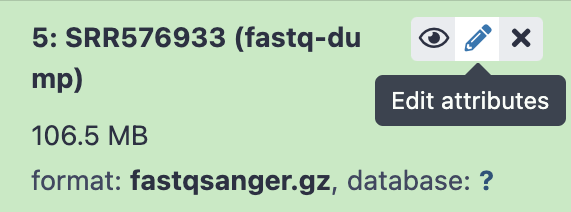

# Introduction to ChIP-seq analysis

Welcome in this tutorial, you will find here a detailed ChIP-seq workflow, starting from sequencing read to the final coverage tracks and differentially accessible genomic regions.

This tutorial is using the Galaxy platform to perform the data download, quality control, mapping and peak calling. We will then explore the result via IGV and RSAT.

## 📍 1. A brief note on ChIP-seq

ChIP-seq stands for **Ch**romatin **I**mmuno **P**recipitation followed by **seq**uencing.

## 📍 2. A brief note on Galaxy

Today, we will work on the Galaxy platform. It's simple, free and open-source.

## 📍 3. Let's start the analysis : downloading the data

We will work on the study from X et al.
[ADD STUDY DETAILS]

Upon publication of their work, authors should deposit their raw data on a publicly available repositories. You can access and download these archives via two main platforms, the Sequence Read Archive (SRA) from NCBI (US) and the European Nucleotide Archive (ENA) from EBI (EU). Both platforms regularly cross-update each other.

To find the correct accession ID in a study, you should look for the following :
* A **BioProject accession**, starting with `PRJ` (*e.g.* `PRJNA176146`), that will link to the complete project archive
* A **GEO identifier**, starting with `GSE` (*e.g.* `GSE41186`), that will link to a specific experiments, in our case ChIP-seq.

⚡️ Your turn : Find the accession identifiers for raw sequencing data from X et al.

  
Tips 👀

  > You are looking for a code starting with `GSE`. You usually find it in the *Data accessibility* section of an article, else you can try to `Ctrl+F` for `GSE` in the paper.

  

You can see in this project that multiple experiments were performed (ChIP-on-ChIP, ChIP-seq, RNA-seq). For the sake of time and simplicity, we will focus our tutorial on the following two ChIP-seq samples :
* ChIP-seq of the FNR protein in anaerobic condition, sample A
* Input DNA in anaerobic condition

❓ Can you guess why we are selecting this pair of dataset?

⚡️ Find the SRA identifier (starts with `SRR`) of these two samples and upload them to Galaxy. Assign them a clear name (*e.g.* **FNR** and **Input**).

❓ Are the sequencing data single-end or paired-end?

🪐 **Get Data** : *Download and Extract Reads in FASTA/Q*

🪐 Assign a new name to a sample :  edit the **Name** attribute via the ✏️`Edit attributes` link and save.

  
Tips 👀

  > The two sample's identifier are `SRR576933` (FNR ChIP) & `SRR576938` (Input).

  > Paste the SSR identifier in Galaxy's tool and click `Execute`. The job will start running and turn green once finished.

  > 

  > Once finished, edit the name for both and group them as a collection (see above).

  

We will group both sample into a **Dataset Collection**. Working on a collection allows to perform the same type of command on both samples in parrallel in a single go.

🪐 Make a Data Collection : To group both sample into a Collection, click the Operations on multiple datasets button in the History, You select the two input files, Click For all selected -> Build data set list. Now you can run all tools on the two files in batch using the Dataset collection button

## 📍 4. Quality Checking

We need to assess the quality of the sequencing reads.
