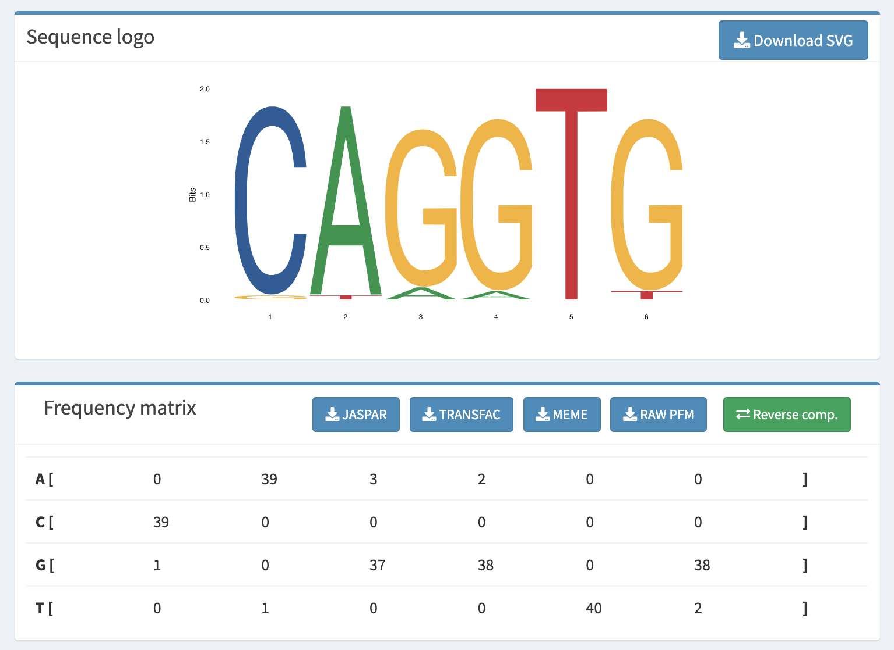

<!--
author:   Swann Flochlay

email:    alexander.botzki@vib.be

version:  0.1

language: en

icon: img/elixir-tess-b37789ea9aced77e795a3c2dc3a2fa583d9dc0e0eb392d589a8cd8d534be8067.svg

narrator: US English Female

comment:  the course is based on the publication.

link:     https://cdn.jsdelivr.net/chartist.js/latest/chartist.min.css

script:   https://cdn.jsdelivr.net/chartist.js/latest/chartist.min.js

@orcid: [@0](@1)<!--class="orcid-logo-for-author-list"-->

-->

# **Introduction to ChIP-seq analysis**

Welcome in this tutorial, you will find here a detailed ChIP-seq workflow, starting from sequencing read to the final coverage tracks and differentially accessible genomic regions.

> We are using the interactive Open Educational Resource online/offline course infrastructure called LiaScript. 
> It is a distributed way of creating and sharing educational content hosted on github.
> To see this document as an interactive LiaScript rendered version, click on the
> following link/badge:
>
> [](https://liascript.github.io/course/?https://raw.githubusercontent.com/abotzki/chip_seq_training/main/README.md)

--------------------------------------------

*About ELIXIR Training Platform*

The ELIXIR Training Platform was established to develop a training community that spans all ELIXIR member states (see the list of Training Coordinators). It aims to strengthen national training programmes, grow bioinformatics training capacity and competence across Europe, and empower researchers to use ELIXIR's services and tools. 

*About VIB and VIB Technologies*

VIB is an entrepreneurial non-profit research institute, with a clear focus on groundbreaking strategic basic research in life sciences and operates in close partnership with the five universities in Flanders – Ghent University, KU Leuven, University of Antwerp, Vrije Universiteit Brussel and Hasselt University.

As part of the VIB Technologies, the 12 VIB Core Facilities, provide support in a wide array of research fields and housing specialized scientific equipment for each discipline. Science and technology go hand in hand. New technologies advance science and often accelerate breakthroughs in scientific research. VIB has a visionary approach to science and technology, founded on its ability to identify and foster new innovations in life sciences.

The goal of VIB Technology Training is to up-skill life scientists to excel in the domains of VIB Technologies, Bioinformatics & AI, Software Development, and Research Data Management.

--------------------------------------------

*Editorial team for this course*

Authors: @[orcid(Bruna Piereck)](https://orcid.org/0000-0001-5958-0669)

Contributors: @[orcid(Alexander Botzki)](https://orcid.org/0000-0001-6691-4233)

Technical Editors: Alexander Botzki

License: [](https://spdx.org/licenses/GPL-3.0-only.html)

-------------------------------------------

This tutorial is using the Galaxy platform to perform the data download, quality control, mapping and peak calling. We will then explore the result via IGV and RSAT.

A small guide for this course :

* ⚡️ : time to shine, this is your hands-on objective
* 👀 : unscroll a help note if you're stuck
* ❓ : quiz time!
* 🪩 : feeling on fire? try this optional exercise
* 🪐 : this is referring to Galaxy
* 🧬 : this is referring to IGV
* 🔮 : this is referring to RSAT

Useful links :

* the [Myers *et al.*](https://journals.plos.org/plosgenetics/article?id=10.1371/journal.pgen.1003565) article
* The [NCBI website](https://www.ncbi.nlm.nih.gov/)
* The [GATK help page](https://gatk.broadinstitute.org/hc/en-us/articles/360035890791-SAM-or-BAM-or-CRAM-Mapped-sequence-data-formats) on alignment formats
* The [UCSC Genome Browser User Guide](https://genome.ucsc.edu/goldenPath/help/hgTracksHelp.html)
* The [RSAT](http://rsat.france-bioinformatique.fr/teaching/) teaching server
* The [Uniprot ressource](https://www.uniprot.org/uniprotkb/P0A9E5/entry) for FNR protein
* The [csaw book](https://bioconductor.org/books/3.15/csawBook/) for differential peak calling
* The [hitchhiker’s guide](https://genomebiology.biomedcentral.com/articles/10.1186/s13059-020-1929-3) to ATAC-seq analysis
* The [ENCODE](https://www.encodeproject.org/) database and [ChIP-seq pipeline](https://pubmed.ncbi.nlm.nih.gov/22955991/)

## 📍 **1. A brief note on ChIP-seq**

ChIP-seq stands for **Ch**romatin **I**mmuno **P**recipitation followed by **seq**uencing.

We can split the analysis as follow :

* **a.** We use antibody to target our DNA-binding protein of interest and fragment the DNA. We then use immunoprecipitation protocol to retrieve the DNA that was binding the targeted Transcription Factor.

* **b** We sequence these fragments using **N**ext **G**eneration **S**equencing
  * 1. We map the reads to a reference genome
  * 2. We detect regions/peaks with enriched IP signal
  * 3. We detect regulatory pattern in the peaks

<div style="text-align:center"></div>

## 📍 **2. A brief note on Galaxy**

Today, we will work on the Galaxy platform. It's simple, free and open-source. It already has all the tools we need installed with proper versions. It's a robust way to design your analysis pipeline while exploring the different available tools.

<div style="text-align:center"></div>


## 📍 **3. Let's start the analysis : loading the raw data**

### 🔸 **3.a Find the identifier**

We will work on the study from [Myers *et al.*](https://journals.plos.org/plosgenetics/article?id=10.1371/journal.pgen.1003565).

⚡️ Open the article : Find the model organism and the targeted proteins in their ChIP-seq experiments.

Upon publication of their work, authors should deposit their raw data on a publicly available repositories. You can access and download these archives via two main platforms, the Sequence Read Archive (SRA) from NCBI (US) and the European Nucleotide Archive (ENA) from EBI (EU). Both platforms regularly cross-update each other.

To find the correct accession ID in a study, you should look for the following :
* A **BioProject accession**, starting with `PRJ` (*e.g.* `PRJNA176146`), that will link to the complete project archive
* A **GEO identifier**, starting with `GSE` (*e.g.* `GSE41186`), that will link to a specific experiments, in our case ChIP-seq.

⚡️ Your turn : Find the accession identifiers for raw sequencing data from Myers *et al.*.

<details>
  <summary>Tips 👀</summary>

  > You are looking for a code starting with `GSE`. You usually find it in the *Data accessibility* section of an article, else you can try to `Ctrl+F` for `GSE` in the paper.

  </details>
<br>

### 🔸 **3.b Load the raw data to Galaxy**

You can see in this project that multiple experiments were performed (ChIP-on-ChIP, ChIP-seq, RNA-seq). For the sake of time and simplicity, we will focus our tutorial on the following two ChIP-seq samples :

* ChIP-seq of the FNR protein in anaerobic condition, sample A
* Input DNA in anaerobic condition


❓ Can you guess why we are selecting this pair of dataset?

❓ Are the sequencing data single-end or paired-end?

⚡️ Find the SRA identifier (starts with `SRR`) of these two samples and upload them to Galaxy. Assign them a clear name (*e.g.* **FNR** and **Input**).

* 🪐 **Get Data** : *Download and Extract Reads in FASTA/Q*
* Assign a new name to a sample :  edit the **Name** attribute via the ✏️`Edit attributes` link and save. <br><div style="text-align:center"></div>

<details>
  <summary>Tips 👀</summary>

  > The two sample's identifier are `SRR576933` (FNR ChIP) & `SRR576938` (Input).<br>
  ><div style="text-align:center"></div>
  ><div style="text-align:center"></div>
  >Paste the SSR identifier in 🪐 Galaxy's tool and click `Execute`. The job will start running and turn green once finished.<br>
  > <div style="text-align:center"></div>
  > Once finished, edit the name for both and group them as a collection (see below).

  </details>

<br>

### 🔸 **3.c Group into a Dataset Collection**

We will group both sample into a **Dataset Collection**. Working on a collection allows to perform the same type of command on both samples in parrallel in a single go.

⚡️ Make a Dataset Collection with both samples

* 🪐 Click the `Operations on multiple datasets` button in the History and select the two renamed input files
<div style="text-align:center"></div>

* 🪐 Select the `Build Dataset List` command and name the collection
<div style="text-align:center"></div>

* 🪐 Now you can run all tools on the two files in batch using the `Dataset collection` input 🎉
<div style="text-align:center"></div>


## 📍 **4. Sweep up the dust : cleaning raw data**

We need to assess the quality of the sequencing reads. We need to know the confidence in the sequence call and the potential presence of contaminants (index or other organism).

### 🔸 **4.a Quality Check of raw data**

FastQC in the most common tool used to get an overview of a fastq file's quality. We will run it with default settings.

⚡️ Run FASTQC on the Dataset Collection with both samples

* 🪐 **FASTQC** : *Reads Quality Report*
* Select the Dataset Collection as input
* Explore the result with the webpage output (`view data`)

❓ Do you see any problem with the quality of the dataset?

<details>
  <summary>Tips 👀</summary>

  > FastQC output comprises several parts, you can refer to the [tool's website](https://www.bioinformatics.babraham.ac.uk/projects/fastqc/) for detailed information. Take a close look to the **Overrepresented sequences** in FNR sample.

  </details>
<br>

### 🔸 **4.b Trimming contaminants**

We have seen in the previous chapter that **29%** of our FNR raw data correspond an Illumina Adapter sequence.

❓ What's an adapter sequence again ?

From here we have two choices :

* **Leave the contaminant sequence** in the dataset and assuming correct read mapping will filter them out
* **Remove the contaminant sequence** from out dataset set prior to mapping

We will hop for the **2nd** choice, as it will provide more acurrate mapping statitics that could help us detect other potential problem in the dataset that prevent a high fraction of mapped reads.

 ⚡️ Trim the contaminant Index sequence on both samples with Trimmomatic

* Copy the Index sequence from the FASTQ output
* 🪐 **Trimmomatic** : *flexible read trimming tool for Illumina NGS data*
* Use the correct data type (single/paired end)
* Set the accuracy of the match between adapter to 8.
* Save the log output <div style="text-align:center"></div>

High accuracy thresholds for short reads will remove adapter dimers but adapter contamination at the 3'end of the reads will remain undetected, this is why we lower the accuracy to 8. A threshold of 8 corresponds to 12 perfect matches between read and adapter, so adapter contamination of 12bp and longer will be detected.

<details>
  <summary>Tips 👀</summary>

  > The overrepresented Adapter Sequence is an Illumina Index 5 :
  ```
>TruSeq Adapter
GATCGGAAGAGCACACGTCTGAACTCCAGTCACA
```
> We can specifically select it as a custom fasta filter :
> <div style="text-align:center"></div>
> <div style="text-align:center"></div>

  </details>
<br>

### 🔸 **4.c Checking trimming**

You can access the trimming statistics in the output log file. Take a look.

❓ How many reads have been discared for each dataset ? How many reads do we have left?

An important question to ask ourself is whehter we have sequenced our sample deep enough. This will depend on two modalities :

* Have we saturated the sequencing library?
* Do we expect to cover the majority of the genome?

❓ How can we solve these two above questions?

<details>
  <summary>Tips 👀</summary>

  > Library is saturated when you have sequenced (almost) all the spot in the lane and you mostly increase duplication level.<br>

  > We must compare the number of good quality reads with the genome size of our organism (*e.g.* for the 3 Gb human genome, 10 million reads are considered sufficient). To do so, take a look at *Escherichia coli*'s genome information on NCBI.

  </details>
<br>

Everything is almost ready, make sure your data now looks all right with a new FASTQC run on trimmed data.

⚡️ Run FASTQC on the Dataset Collection **after** trimming

❓ Is the Adapter sequenced properly filtered out?

🪩 You can merge multiple FASTQC output in a fancy way with **MultiQC**, try it out!

## 📍 **5. Gotta map them all : read alignment**

Mapping is a step where you can explore a very large parameter space. We need to be careful about our selected settings.

### 🔸 **5.a Loading a reference genome**

First thing first, what map do we use? We can check that in the article's text.

❓ What is the model organism used?

❓ What is the reference genome of the study?

🪩 Try to fetch its information back from the [NCBI website](https://www.ncbi.nlm.nih.gov/)

<details>
  <summary>Tips 👀</summary>

  > You can see the sentence *Resulting reads were aligned to the published E. coli K-12 MG1655 genome (U00096.2)* in the Materials and Methods section

  </details>
<br>

This reference comes from NCBI Nucleotide database, which is not ideal (large amount of errors in sequences and annotations). It is now highly recommended to work with **NCBI Reference Sequence** (RefSeq) data, the curated subset of NCBI’s Nucleotide database. Similar to sample identifier, reference genome also have a unique ID.

⚡️ Find E.Coli RefSeq genome ID and upload it to Galaxy
* 🪐 **NCBI Accession Download** : *Download sequences from GenBank/RefSeq by accession through the NCBI ENTREZ API*
* Paste the RefSeq ID as a direct entry, keep output as fasta

<details>
  <summary>Tips 👀</summary>

  > The RefSeq ID for the E.Coli strain K-12 MG1655 is `NC_000913.3`. You can find it by searching this strain on NCBI's nucleotide database (1), filtering for RefSeq match only (2) and looking at the 1st entry (3).
  ><div style="text-align:center"></div>
  > You can then paste it to Galaxy genome loader
  ><div style="text-align:center"></div>

  </details>
<br>


### 🔸 **5.b Selecting mapping parameters**

There's plenty of mappers available, you probably have already heard of STAR, Bowtie and BWA for example. We need to select the appropriate one for our data.

We have **short** (36bp) and **single-end** reads, this is best suited for **Bowtie**.

Now the tricly part : understanding and playing with the parameters.

⚡️ Take a look at the Bowtie **-v** and **-n** parameters in Galaxy parameter list.
* 🪐 **Map with Bowtie for Illumina**

❓ What is the `-v 2` parameter doing?

❓ What are the `-n 2 -l 35` parameters doing?

❓ Make a guess : which of the two options would you pick here?

🪩 Do you see any other parameter that would have been useful to us?

<details>
  <summary>Tips 👀</summary>

  > The Bowtie **v-mode** performs end-to-end alignment of the read and filter out the ones with more than *n* mismatches. <br>
  > The Bowtie **n-mode** aligns a seed of *l* basepairs from the high quality 5'end and remove the ones with more than *n* mismatches. <br>
  > Remember your FASTQC reports, does the **Per base sequence quality** graph hint a something you would want to exclude? <br>

  </details>
<br>

These two parameters modify the **alignment** strategy, we also need to take care of the **reads reporting** strategy.

⚡️ Take a look at the Bowtie **-m** and **--un** parameters in Galaxy parameter list.

❓ What are the `-m 1` or `-m 3` parameters doing?

❓ What is the `--un` parameter doing?

❓ Make a guess : which parameter set would you pick here?

<details>
  <summary>Tips 👀</summary>

  > **-m** discards reads that map to more than *n* reported genome locations <br>
  > **--un** write the reads that failed to align in a separate file, think about why this would be useful. <br>

  </details>
<br>

### 🔸 **5.c Mapping the reads with Bowtie**

Now that we have explored the Bowtie parameter space, let's map our reads to the E.Coli reference genome.

⚡️ Map both trimmed samples with Bowtie on E.Coli RefSeq genome
* 🪐 **Map with Bowtie for Illumina**
* Genome index is done before mapping, keep default settings
* Expand Bowtie full parameter list
* Perform a **seed-based** alignment with a seed of **35bp** and a maximum of **2 mismatches**.
* **Discard** all the reads that map to multiple positions
* Save the bowtie mapping statistics to the history

<details>
  <summary>Tips 👀</summary>

  > Select the tool **Map with Bowtie for Illumina** and fill the parameter form. Select the RefSeq genome as a single file and not a collection.
  ><div style="text-align:center"></div>
  > Expand Bowtie parameter form
  ><div style="text-align:center"></div>
  > Select n-mode mapping with a 35bp seed and max 2 mismatches
  ><div style="text-align:center"></div>
  > Remove multi-mapping reads
  ><div style="text-align:center"></div>
  > Save the mapping output to Galaxy history
  ><div style="text-align:center"></div>

  </details>
<br>


⚡️ After reads have finished mapping, check the mapping statistics output.

❓ How many alignment are reported per sample?

❓ Does the mapping ratio seem good enough?

🪩 Check the mapping statistics with **Samtools flagstat** : *tabulate descriptive stats for BAM datset*

🪩 Run another mapping job with other Bowtie parameters or the untrimmed samples, how does is affect the mapping performances?

<details>
  <summary>Tips 👀</summary>

  > Take a look at the *mapping stats* output of Bowtie, scroll down the short read warning down to the global stats.
  > You should obtain the following result :
  > * Input sample has **6217172** alignments with **94.67%** mapped reads.
  > * FNR sample has **2173747** alignments with **89.98%** mapped reads<br>

  </details>
<br>

Everything good on the mapping statistics side, let's take a closer look a the *mapped reads* output now.

❓ What is the alignment file format?

❓ What is the **SO** (sorting order)?

<details>
  <summary>Tips 👀</summary>

  > The output mapped reads are stored in a **SAM** file format. You can see this in the **Attributes** section of the data. For more detail on this format, check the [GATK help page](https://gatk.broadinstitute.org/hc/en-us/articles/360035890791-SAM-or-BAM-or-CRAM-Mapped-sequence-data-formats) and the image below (credit : D. Caetano-Anolles).
  ><div style="text-align:center"></div>

  > The SAM files are **Unsorted** (*i.e.* reads are unordered), you can see this is the SAM header.
  ><div style="text-align:center"></div>

  </details>
<br>

⚡️ Sort the mapping output by genomic coordinates and save it as a compressed BAM output

* 🪐 **Samtools sort** : *order of storing aligned sequences*
* Use the *coordinate* sorting key
* Make sure the output is a coordinate-sorted **BAM** file

## 📍 **6. Reaching the summits : Peak calling**

### 🔸 **6.a A brief note on Peak Calling algorithm**

Here we are!

We have our data ready, we can now get to the detection of biological signal by detecting genomic position with enriched ChIP signal.

The most widely used tools for this is the good old **MACS** (**M**odel-based **A**nalysis for **C**hIP-**S**eq) tool. It is used for ChIP-seq as well as for ATAC-seq. It can robustly detect peaks of different profiles (*e.g.* broad or narrow). Current version is MACS2, beta MACS3 is on its way. Check its [GitHub repo](https://github.com/macs3-project/MACS) for more details.

❓ What's behind a peak calling algorithm?

The goal of MACS2 is to **detect region significantly enriched for chromatin immunoprecipitation signal** (our FNR IP) **compared to a given background**. The input sample does exactly that : it gives a measure of the background signal obtain without a targetted IP. In order to pecisely detect the position of the binding protein, MACS2 performs a modelling approach to estimate the initial DNA fragment length that was obtained from IP and **shift/extend** the reads accordingly.

<div style="text-align:center"></div>

The enrichment score is then computed by comparing the enrichment in a **sliding window** between the IP and the Input signal based on a **Poisson** distribution. To avoid bias in background noise, MACS2 compute the Poisson lambda values from the input signal with **severeal windows sizes** (1kb, 10kb, whole genome).

### 🔸 **6.b Extracting FNR and Input sample from the Collection**

Now that you know what MACS2 need to do, select the proper input files. We need to specifically assign both samples as **treatment** and **control** files, so we need to extract them separately from the collection.

⚡️ Extract FNR and Input sorted BAM files from the Dataset collection
* 🪐 **Extract Dataset** *from a list*
* Select the element identifier (*i.e* the name you assigned)
* Run once per sample and check the output file attributes

<div style="text-align:center"></div>

### 🔸 **6.c Running MACS2 callpeak**

We have our BAM files ready, now let's take a look at the required parameters of MACS2 on the Galaxy platform.

* 🪐 **MACS2 callpeak** : *Call peaks from alignment results*

❓ What is the effective genome size and why is it needed?

❓ Should we build a shifting model?

❓ What are duplicate tags and how MACS2 treat them? Remember you also have duplicate informatiom from the FastQC output.

❓ How a change in the p-value cutoff impact the result?

<details>
  <summary>Tips 👀</summary>

  > The **effective genome size**  is the portion of the genome that is mappable. There is no predefined value for E.Coli, we will use the complete genome size of the reference.<br>
  > The **shifting model** is doable when we have enough reads and enough detected peaks, or ideally paired-end data. This is not the case in our sample. We will not use a model.<br>
  > **Duplicates** are read the uniquely align to the exact same position that might come from PCR duplicates. We can ignore them with the default parameter `--keep-dup 1` in the Advanced Options.<br>
  > If you want to remove your duplicates rather than ignoring them, use the Picard tool 🪐 **MarkDuplicates** : *examine aligned records in BAM datasets to locate duplicate molecules*. 🪩 You can give it a try on the sorted BAM files.<br>
  > The **p-value (or p-adjusted) threshold** set the limit for calling a peak, the lower the threshold, the higher the number of reported peaks. This is a critical parameter to take into account.
  </details>
<br>

All onboard, we're ready to launch MACS2 run!

⚡️ Run MACS2 callpeak on FNR ChIP-seq with input as control.
* 🪐 **MACS2 callpeak** : *Call peaks from alignment results*
* Set E.Coli effective genome size to 4641652bp
* Set the MACS2 peak calling to run without model, with a 0 shift and a 200bp extsize
* Ignore duplicates
* Save a BedGraph output

❓ What does MACS2 when given `--no-model --shift 0 --extsize 200`?

❓ How many region have been reported, what is the output file format?

<details>
  <summary>Tips 👀</summary>

  > Select FNR IP as **treatment** and input as **control**
  ><div style="text-align:center"></div>
  > Do not build a model
  ><div style="text-align:center"></div>
  > Select an additional BedGraph output
  ><div style="text-align:center"></div><br>

  > The output file is a **BED** file, we report **213** peaks enriched in FNR IP.
  ><div style="text-align:center"></div>
  </details>
<br>

🪩 Explore the different output files on your own, can you guess what they refer to? Expand the **Tool Standard Output** section in Galaxy output info, do you understand the log message?

🪩 Run another MACS callpeak with a different p-value or with the modelling on, what happens?

## 📍 **7. Enjoying the landscape : Data visualization**

### 🔸 **7.a Converting tracks to BigWig**

We have a **BAM** output for read alignment signal and a **BED** output for peaks. For signal browsing and large dataset, it is more efficient to work with **BigWig** and **BigBed** file format. **BigWig** fill will summarise the individual read information from **BAM** into a sum of read mapping on each position of the genome. **BigBed** is the indexed binary equivalent of **BED**. For a detail explanation of the BigWig formats, see the **UCSC Genome Browser** help on [bigWig](https://genome.ucsc.edu/goldenpath/help/bigWig.html) and [bigBed](https://genome.ucsc.edu/goldenpath/help/bigBed.html). As our BED file is small, we will not convert it to BigBed here.

⚡️ Convert both FNR IP and input BAM file to BigWig with **DeepTools**.
* 🪐  **bamCoverage** : *generates a coverage bigWig file from a given BAM or CRAM file*
* Use the **sorted BAM files** as input.
* Keep the default **50bp** granularity
* Use the **1x** coverage normalisation
* Set E.Coli effective genome size to **4641652bp**
* We are aiming to generate the track visualisation that most closely match our MACS2 analysis, so we need to also **ignore the Duplicates** and extend our single-end reads to **200bp** (see *Advanced Options*).

❓ What is the 1x normalisation? Why do we need it?

<details>
  <summary>Tips 👀</summary>

  > Select FNR IP and Input **sorted BAM** as input
  ><div style="text-align:center"></div>
  > Extend single-end reads to 200bp and ignore duplicates
  ><div style="text-align:center"></div>

  </details>
<br>

### 🔸 **7.b Assessing the quality of the peaks and FNR IP**

We now have the two required inputs for DeepTools graphs :
* A set of regions (ours MACS2 peaks as BED file)
* A set of signal tracks (our FNR and input BigWig files)

DeepTools is a very efficient tool for signal exploration, and it comes with an easy-to-use [online manual](https://deeptools.readthedocs.io/en/develop/index.html). It is usually done in two steps :
1. **pre-compute** the signal for the region of interest
2. **plot** the signal in your requested format

In this tutorial, we will do a **Profile** plot, but you can explore other possibilities there (*e.g.* Heatmaps)!

⚡️ Compute the signal matrix using **DeepTools**.
* 🪐  **computeMatrix** : *prepares data for plotting a heatmap or a profile of given regions*
* Select our MACS2 peaks as regions to plot
* Select the **BamCoverge** collection output as score files. Do not use the BAM file directl, as they are not 1x normalised it will make them harder to contrast.
* Use the **reference-point** mode centered as region's center and **1kb** window up/downstream.

❓ Why don't we use the **scale-region** mode? See [DeepTools manual](https://deeptools.readthedocs.io/en/develop/content/tools/computeMatrix.html#details) for help.

<details>
  <summary>Tips 👀</summary>

  > Select regions and signal track inputs
  ><div style="text-align:center"></div>
  > Use the reference-point mode
  ><div style="text-align:center"></div>

  </details>
<br>

Now the visualization part!

⚡️ Generate the Profile plot using **DeepTools**.
* 🪐  **plotProfile** : *creates a profile plot for score distributions across genomic regions*
* Use our freshly-computed matrix as input
* Our tracks are 1x normalised, we can group them in the same plot

<details>
  <summary>Tips 👀</summary>

  > Select matrix as input
  ><div style="text-align:center"></div>
  > Group the two signal (FNR and input) in the same plot
  ><div style="text-align:center"></div>

  </details>
<br>

❓ Is the output graph consistent with our biological hypothesis?

Ok, the signal in our detected MACS2 peaks seems good! Yet, this plot is only focusing on our **selected regions**, how can we make sure our ChIP-seq worked? To answer that, we should look at the general distribution of ChIP-seq signal across the genome :
* If the FNR ChIP **worked**, we expect *a small number of peaks with high signal* and the rest with low signal
* If the FNR ChIP **failed**, we expect it to ressemble the non-specific Input, meaning *a uniform low signal in every region*

To assess where we are standing, we need to compute the **Fingerprint** of our data (*aka* the **Lorenz curve**), it's a quality-check plot that is also supported in DeepTools (told you this tool is great). You also have a nice explanatory section about it on the [DeepTools manual](https://deeptools.readthedocs.io/en/develop/content/tools/plotFingerprint.html?highlight=plotFingerprint#what-the-plots-tell-you).

⚡️ Generate the Lorenz curve for our FNR IP and Input data
* 🪐  **plotFingerprint** : *plots profiles of BAM files; useful for assessing ChIP signal strength*
* Select our Collection of **sorted BAM** files as input
* For time sake (and using E.Coli), reduce the **sampling rate** to 1000
* Same as the other plot, extend reads to **200bp** and **ignore duplicates**

<details>
  <summary>Tips 👀</summary>

  > Select matrix as input
  ><div style="text-align:center"></div>
  > Group the two signal (FNR and input) in the same plot
  ><div style="text-align:center"></div>
  ><div style="text-align:center"></div>
  </details>
<br>

❓ On a scale of Challenger Deep to Mt Everest, how *peaky* is our IP?

### 🔸 **7.c Browsing the signal in the Genome**

We have our data, we have visualised it's overall quality at full genome scale and at MASC2 peak levels. Now, we want to go look a specific examples of regions. To do so, we will use a **Genome Browser** that will serves as a search tool.

We will use the 🧬 **I**ntegrative **G**enome **V**iewer (**IGV**) that you should have installed locally on your machine. Another widely used browser is the [**UCSC Genome Browser**](https://genome.ucsc.edu/), which can be used online.

To get IGV up and running, we need to download locally some of our Galaxy output files :
* The E.Coli genome sequence as a **FASTA** files and its gene annotation as a **GFF3** file.
* The MACS peaks of FNR signal as **BED** file
* The normalised FNR and input signal as **BigWig** files

⚡️ Save the FASTA, BED and BigWig files locally from Galaxy history
* 🪐 Scroll down your history and simply use the *download* button, unzip the bigwig collection

<div style="text-align:center"></div>
<div style="text-align:center"></div>
<div style="text-align:center"></div>

We're just missing the GFF3 file of gene annotations. We haven't loaded to Galaxy. To retrieve it, we must go back to where we found the E.Coli fasta sequence.

⚡️ Find the correct gene annotation file for our refrence genome
* Remember that our *E.Coli genome* is from the RefSeq database (chapter **5.a**)

<details>
  <summary>Tips 👀</summary>

  > The RefSeq ID for the E.Coli strain K-12 MG1655 is `NC_000913.3`. You can find it by searching this strain on NCBI's nucleotide database (1), filtering for **RefSeq** match only (2) and looking at the **1st** entry (3).
  ><div style="text-align:center"></div>

  > On the RefSeq page, you can ask for a local data drop via the **Send to** tab.<br>
  ><div style="text-align:center"></div>

  </details>
<br>

Ready to go? Let's turn IGV on and load all our files!

⚡️ Get IGV ready to explore
* 🧬 **Genomes** : *Load Genome from file...*
* Select the RefSeq fasta sequence
* 🧬 **File** : *Load from file...*
* Select the BED, GFF3 and BigWig files
* For better visualisation, **comment** (add `##` at the beginning of the line) the third line of the GFF3 in a raw text editor (*i.e.* not word) before loading.
<div style="text-align:center"></div><br>

To be able to compare our FNR IP with input, we need to look at them with the **same y-axis** and comparable **normalisation strategies**! Both tracks are 1x-normalised, so we should just make sure the y-axis range is always the same for the two tracks.
* 🧬 **Select BigWig tracks** : Right-clik and *Group Autoscale*
* 🧬 **Select BigWig tracks** : Right-clik and *Show Data Range*
* 🧬 **Select BED tracks** : Right-clik and *Expanded*
* Start browsing, zoom in, zoom out, customise your tracks, ..
* Go to the following genes : *pepT*, *ycfP*

❓ What would have happen if we did not took care of group auto-scaling?

❓ Anything interesting to see ?

🪩 IGV also support BAM file as input, load the FNR sorted BAM from Galaxy to IGV (careful, large file).

🪩 Sort the MACS2 BED file on Galaxy by the Score column to get highest and lowest scoring reported peaks. Which one do you trust most?

<details>
  <summary>Tips 👀</summary>

  > Here is a view of *pepT* location
  ><div style="text-align:center"></div>

  > Here is a close-up of the **BAM** track for FNR IP, it automatically computes a global coverage track upon loading. Can you understand what the grey lines and the small colored lines represent?<br>
  ><div style="text-align:center"></div>

  > 🪐 **Sort data** *in ascending or descending order* to find **FNR_peak_64** and **FNR_peak_122** as top and bottom scoring peak respectively<br>

  </details>
<br>

## 📍 **8. Finding motifs in the sequences**

### 🔸 **8.a A brief note on RSAT and motif discovery**

Now that we have the predicted binding sites of FNR, we can explore further the binding interaction. Based on the **region sequences**, we can look for enriched DNA motif that would have a high affinity with FNR. This motifs are usually call **Transcription Factor Binding Motifs** (**TFBS**) and are defined as a **P**osition **W**eight **M**atrix (**PWM** or **sequence logo**).

Several PWM databases exist, usually focusing on a subset of model organisms (*e.g.* **RegulonDB** for prokaryotes, **TRANSFAC** and **JASPAR** for eukaryotes) and curated for redundancy and motif quality.

The *snail* PWM seen from the **JASPAR** database :
<div style="text-align:center"></div>

To find these motifs, we will use the 🔮 **R**egulatory **S**equence **A**nalaysis **T**ool ([**RSAT**](http://rsat.france-bioinformatique.fr/teaching/)). It's an easy-to-use online tool that support a large number of organisms. Other tools exist such as **i-*cis* target**, the **MEME** suite and **HOMER**. Each of them use their own set of discovery algorithms and parameters, feel free to explore them and pick the best-suited one for your own analysis.


### 🔸 **8.b Running motif discovery**

Time to look for motifs!

If you follow the small questionnaire on the welcome page on which tool to use, you will see that **peak-motif** is our way to go. Yet, this tool needs the fasta sequence of our MACS2 peaks.

⚡️ Use Galaxy to export our MASC2 peak set as **fasta**
* 🪐 **bedtools GetFastaBed** : *use intervals to extract sequences from a FASTA file*
* Use MASC2 narrowpeak output as input
* Download the resulting fasta locally

<details>
  <summary>Tips 👀</summary>

  ><div style="text-align:center"></div>

  </details>
<br>

All set for peak-motif!

⚡️ Use RSAT Prokaryotes server to find enriched motifs in our peak set
* 🔮 **peak-motif**
* Find a relevan title and select your fasta file as *Peak sequences*
* Do **not cut** the peak sequence
* Look **6bp and 7bp oligomer** search, as well as **dyad** analysis
* Compare your resulting enriched motifs with prokaryote database

<details>
  <summary>Tips 👀</summary>

  ><div style="text-align:center"></div>
  > To avoid cutting peaks, set the cutting length to 0. Tick the *Spaced word pairs* analysis.
  ><div style="text-align:center"></div>
  > The prokaryote database is RegulonDB, select the 2015 collection.
  ><div style="text-align:center"></div>

  </details>
<br>

❓ Do you understand all the resut panels?

❓ Do you see evidence of FNR binding?

❓ What would have happened if we did not select dyad analysis?

### 🔸 **8.c Going further**

🏁 Congrats, you made it to the final section!

Through this tutorial you have seen the following :
* **Finding** a study of interest and **extracting** raw NGS data
* **Quality-filtering** and **mapping** the reads to a reference genome
* **Calling peaks** with significant IP enrichment with MACS2
* **Exporting** data as explorable BigWig and BED tracks
* **Visualizing** our result with DeepTools, at region and genome scale
* **Finding motifs** of enriched TFBS in our peak set using RSAT

🚨 Note that this analysis was performed on **single-end**, **prokaryote**, **FNR IP** data. If you want to apply this workflow to other data types, you should consider some additional tunings.

🔹 **ATAC-seq** : ATAC-seq also target chromatin, but contrary to ChIP, it does not use targetted antibody. As a result, it is not particularly advised to run MACS for ATAC peak *with* the model option (instead, use *--no-model*). Otherwise, you can also perfrom the same analysis as ChIP-seq (DeepTools, motif enrichment)

🔹 **mapping** : As always, make sure you use the correct reference genome. Here we used Bowtie as we are dealing with short single-end sequence. For longer (~150/200bp) paired-end reads, you can use other better-suited mapper such as **BWA-MEM** (used in CellRangerATAC). If you decide to use the famous **STAR** mapper, don't forget it's originally designed for RNA-seq data and you should enforce the *--alignIntronMax 1 --alignEndsType EndToEnd* options to forbid spliced alignment.

🔹 **paired-end data** : These reads do not need to be manually extended, peak-calling algorithm will simply join the respective mates. To do so, specify this information in MACS with *-f BAMPE*.

🔹 **motif database** : Do not use RegulonDB for **eukaryote** data, also change the RefSeq genome accordingly (and make sure you adapt parameters linked to genome size too)

🔹 **TF/Histone peaks** : Accessibility peaks can have various shape of peaks (e.g. H3K27ac vs CTCF). To take this into account, you can explore MACS2 options for broad peak calling.

🔹 **In general, always scan the parameter options again to make sure your data match your analysis.**


Hope you enjoyed the ride! Below, you can find some extra ressource for further ChIP-seq and ATAC-seq analysis :

**Peak annotation** : You can use the R package [ChIPseeker](https://guangchuangyu.github.io/software/ChIPseeker/) to annotate your peaks based on nearest annotated features (*e.g.* gene TSS)

**Replicates** : If you have multiple IP for the same protein and you want to integrate them into a common peak calling analysis, you can use the **I**rreproducible **D**iscovery **R**ate ([IDR](https://github.com/nboley/idr)) methodology. For a detailed overview of this method, check [M. Love's example](https://biodatascience.github.io/compbio/test/IDR.html).

**No Input** : If you do not have an input, you can still run MACS2, but keep in mind it is not advised as you will obtain false positive peaks that arise from non-specific enrichment.

**Differential enrichment & ATAC** :  If you are looking for a quantitative analysis of different signal enrichment between conditions, several options exist. You can try the R packages [**DiffBind**](https://bioconductor.org/packages/release/bioc/html/DiffBind.html) and [**csaw**](https://bioconductor.org/packages/release/bioc/html/csaw.html). They are based on DESeq2 and EdgeR models respectively. Good news, although these tools have been initially designed for ChIP-seq, they nicely expand to ATAC-seq analysis! They also both have a very large online documentation.

**In case of doubt** : Old but gold, you can read the [article](https://pubmed.ncbi.nlm.nih.gov/22955991/) on ChIP-seq guidelines and practices of the ENCODE and modENCODE consortia. It's a robust pipeline used for creating the ENCODE database.
