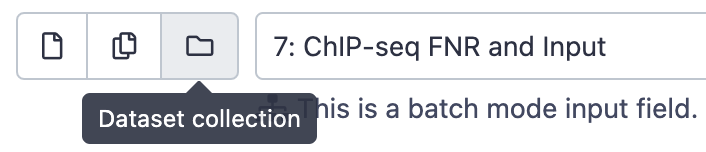

# **Introduction to ChIP-seq analysis**

Welcome in this tutorial, you will find here a detailed ChIP-seq workflow, starting from sequencing read to the final coverage tracks and differentially accessible genomic regions.

This tutorial is using the Galaxy platform to perform the data download, quality control, mapping and peak calling. We will then explore the result via IGV and RSAT.

A small guide for this course :
  * ⚡️ : time to shine, this is your hands-on objective
  * 👀 : unscroll a help note if you're stuck
  * ❓ : quiz time!
  * 🪐 : this is a how-to referring to Galaxy

## 📍 **1. A brief note on ChIP-seq**

ChIP-seq stands for **Ch**romatin **I**mmuno **P**recipitation followed by **seq**uencing.

## 📍 **2. A brief note on Galaxy**

Today, we will work on the Galaxy platform. It's simple, free and open-source.

## 📍 **3. Let's start the analysis : downloading the data**

### 🔸 **3.a Find the identifier**

We will work on the study from X et al.
[ADD STUDY DETAILS]

Upon publication of their work, authors should deposit their raw data on a publicly available repositories. You can access and download these archives via two main platforms, the Sequence Read Archive (SRA) from NCBI (US) and the European Nucleotide Archive (ENA) from EBI (EU). Both platforms regularly cross-update each other.

To find the correct accession ID in a study, you should look for the following :
* A **BioProject accession**, starting with `PRJ` (*e.g.* `PRJNA176146`), that will link to the complete project archive
* A **GEO identifier**, starting with `GSE` (*e.g.* `GSE41186`), that will link to a specific experiments, in our case ChIP-seq.

⚡️ Your turn : Find the accession identifiers for raw sequencing data from X et al.

  
Tips 👀

  > You are looking for a code starting with `GSE`. You usually find it in the *Data accessibility* section of an article, else you can try to `Ctrl+F` for `GSE` in the paper.

  

 

### 🔸 **3.b Load the raw data to Galaxy**

You can see in this project that multiple experiments were performed (ChIP-on-ChIP, ChIP-seq, RNA-seq). For the sake of time and simplicity, we will focus our tutorial on the following two ChIP-seq samples :

* ChIP-seq of the FNR protein in anaerobic condition, sample A
* Input DNA in anaerobic condition

❓ Can you guess why we are selecting this pair of dataset?

❓ Are the sequencing data single-end or paired-end?

⚡️ Find the SRA identifier (starts with `SRR`) of these two samples and upload them to Galaxy. Assign them a clear name (*e.g.* **FNR** and **Input**).
* 🪐 **Get Data** : *Download and Extract Reads in FASTA/Q*
* 🪠Assign a new name to a sample :  edit the **Name** attribute via the âœï¸`Edit attributes` link and save.  

  
Tips 👀

  > The two sample's identifier are `SRR576933` (FNR ChIP) & `SRR576938` (Input). 
  >

  >

  >🪠Paste the SSR identifier in Galaxy's tool and click `Execute`. The job will start running and turn green once finished. 
  > 

  > Once finished, edit the name for both and group them as a collection (see below).

  

 

### 🔸 **3.c Group into a Dataset Collection**

We will group both sample into a **Dataset Collection**. Working on a collection allows to perform the same type of command on both samples in parrallel in a single go.

⚡️ Make a Dataset Collection with both samples

* 🪐 Click the `Operations on multiple datasets` button in the History and select the two renamed input files

* 🪐 Select the `Build Dataset List` command and name the collection

* 🪐 Now you can run all tools on the two files in batch using the `Dataset collection` input 🎉

## 📍 4. Quality Checking

We need to assess the quality of the sequencing reads. We need to know the confidence in the sequence call and the potential presence of contaminants (index or other organism).

### 🔸 **4.a Quality Check of raw data**

FastQC in the most common tool used to get an overview of a fastq file's quality. We will run it with default settings.

⚡️ Run FASTQC on the Dataset Collection with both samples

* 🪐 **FASTQC** : *Reads Quality Report*
* 🪐 Select the Dataset Collection as input
* 🪐 Explore the result with the webpage output (`view data`)

❓ Do you see any problem with the quality of the dataset?

  
Tips 👀

  > FastQC output comprises several parts, you can refer to the [tool's website](https://www.bioinformatics.babraham.ac.uk/projects/fastqc/) for detailed information. Take a close look to the **Overrepresented sequences** in FNR sample.

  

 

## 📍 **4. Sweep up the dust : cleaning raw data**

### 🔸 **4.a Trimming contaminants**

We have seen in the previous chapter that **29%** of our FNR raw data correspond an Illumina Adapter sequence.

❓ What's an adapter sequence again ?

From here we have two choices :

* Leave the sequence in the dataset and assuming correct read mapping will filter them out
* Remove the contaminant sequence from out dataset set prior to mapping

We will hop for the **2nd** choice, as it will provide more acurrate mapping statitics that could help us detect other potential problem in the dataset that prevent a high fraction of mapped reads.

 ⚡️ Trim the contaminant Index sequence on both samples with Trimmomatic
